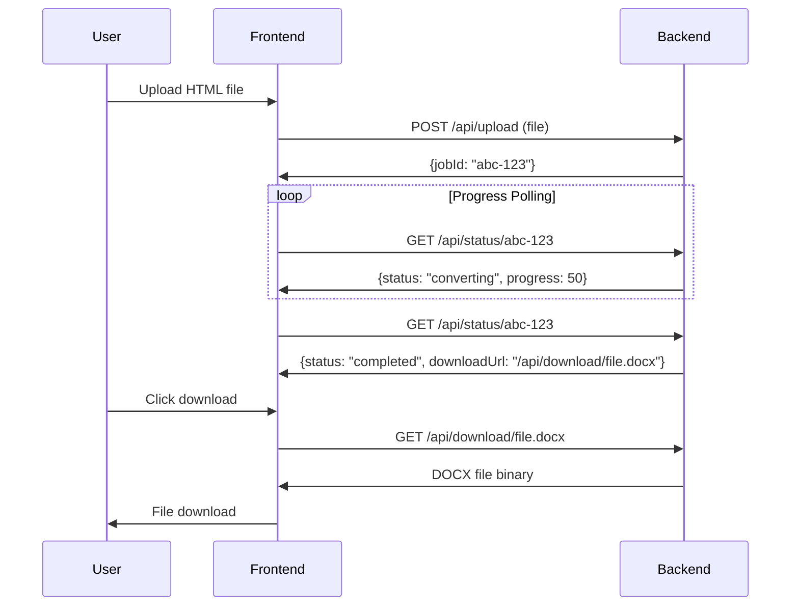

# HTML to DOCX Converter

🚀 **A Modern Web Application for Converting HTML Files to DOCX Format**

This project is a full-stack web application that seamlessly converts HTML files to Microsoft Word (DOCX) format. It features a beautiful React frontend built with modern UI components and a robust Flask backend that handles the conversion process.

## 📋 Table of Contents

- [Features](#-features)
- [Architecture Overview](#-architecture-overview)
- [How It Works](#-how-it-works)
- [Project Structure](#-project-structure)
- [Getting Started](#-getting-started)
- [API Documentation](#-api-documentation)
- [Frontend-Backend Communication](#-frontend-backend-communication)
- [Conversion Process](#-conversion-process)
- [Troubleshooting](#-troubleshooting)
- [Contributing](#-contributing)

## ✨ Features

- **🎯 Drag & Drop Interface**: Intuitive file upload with drag-and-drop support
- **📁 Multiple File Processing**: Upload and convert multiple HTML files simultaneously
- **⚡ Real-time Progress Tracking**: Live progress updates during conversion
- **🎨 Modern UI**: Beautiful, responsive interface built with Tailwind CSS and shadcn/ui
- **🔄 Job-based Processing**: Asynchronous conversion with status tracking
- **📥 Instant Downloads**: Direct download links for converted DOCX files
- **🌙 Dark Mode Support**: Toggle between light and dark themes
- **📱 Mobile Responsive**: Works seamlessly on all device sizes
- **🛡️ Error Handling**: Comprehensive error handling and user feedback

## 🏗️ Architecture Overview

This application follows a **client-server architecture** with clear separation of concerns:

```
┌─────────────────┐    HTTP Requests    ┌─────────────────┐
│                 │ ──────────────────► │                 │
│   Frontend      │                     │   Backend       │
│   (React +      │ ◄────────────────── │   (Flask +      │
│   TypeScript)   │    JSON Responses   │   Python)       │
│                 │                     │                 │
└─────────────────┘                     └─────────────────┘
│                                       │
│ • User Interface                      │ • File Processing
│ • File Upload                         │ • HTML Parsing
│ • Progress Display                    │ • DOCX Generation
│ • Download Management                 │ • Job Management
└───────────────────────────────────────┘
```

### Frontend (React + TypeScript)
- **Framework**: React 18 with TypeScript for type safety
- **Styling**: Tailwind CSS with shadcn/ui components
- **Build Tool**: Vite for fast development and building
- **State Management**: React hooks (useState, useCallback)
- **HTTP Client**: Fetch API for backend communication

### Backend (Flask + Python)
- **Framework**: Flask web framework
- **HTML Parsing**: BeautifulSoup4 for HTML content processing
- **Document Generation**: python-docx for DOCX file creation
- **CORS**: Flask-CORS for cross-origin requests
- **Job Management**: In-memory job tracking with threading

## 🔄 How It Works

### Step-by-Step Process:

1. **File Upload** 📤
   - User selects or drags HTML files to the upload area
   - Frontend validates file types and creates upload jobs

2. **Backend Processing** ⚙️
   - Files are sent to Flask backend via `/api/upload` endpoint
   - Backend generates unique job IDs for tracking
   - HTML content is parsed using BeautifulSoup4
   - Content is converted to DOCX format using python-docx

3. **Progress Tracking** 📊
   - Frontend polls `/api/status/<jobId>` for real-time updates
   - Backend reports progress: pending → converting → completed

4. **File Download** 📥
   - Completed files are available via `/api/download/<filename>`
   - Users can download converted DOCX files instantly

## 📁 Project Structure

```
HTML-to-DOCX-Converter/
├── 📁 frontend/                 # React frontend application
│   ├── 📁 src/
│   │   ├── 📁 components/       # Reusable UI components
│   │   │   ├── ConversionService.tsx    # API service layer
│   │   │   ├── FileUpload.tsx           # File upload component
│   │   │   ├── Layout.tsx               # App layout wrapper
│   │   │   └── 📁 ui/                   # shadcn/ui components
│   │   ├── 📁 pages/            # Page components
│   │   │   └── Index.tsx        # Main application page
│   │   ├── 📁 hooks/            # Custom React hooks
│   │   └── 📁 lib/              # Utility functions
│   ├── package.json             # Frontend dependencies
│   └── vite.config.ts           # Vite configuration
│
├── 📁 backend/                  # Flask backend application
│   ├── app.py                   # Main Flask application
│   ├── requirements.txt         # Python dependencies
│   ├── 📁 uploads/              # Temporary file storage
│   └── 📁 outputs/              # Generated DOCX files
│
└── README.md                    # This documentation
```

## 🚀 Getting Started

### Prerequisites

Before running this application, make sure you have:

- **Node.js** (v16 or higher) - [Download here](https://nodejs.org/)
- **Python** (v3.8 or higher) - [Download here](https://python.org/)
- **npm** or **yarn** package manager
- **pip** Python package manager

### Installation

1. **Clone the repository:**
   ```bash
   git clone https://github.com/GurnoorSH/HTML-to-DOCX-Converter.git
   cd HTML-to-DOCX-Converter
   ```

2. **Set up the backend:**
   ```bash
   # Navigate to backend directory
   cd backend
   
   # Install Python dependencies
   pip install -r requirements.txt
   
   # Return to project root
   cd ..
   ```

3. **Set up the frontend:**
   ```bash
   # Navigate to frontend directory
   cd frontend
   
   # Install Node.js dependencies
   npm install
   
   # Return to project root
   cd ..
   ```

### Running the Application

**Important**: You need to run both frontend and backend servers simultaneously.

#### Terminal 1 - Backend Server:
```bash
cd backend
python app.py
```
✅ Backend will start on `http://localhost:5000`

#### Terminal 2 - Frontend Server:
```bash
cd frontend
npm run dev
```
✅ Frontend will start on `http://localhost:5173`

#### Access the Application:
Open your browser and navigate to `http://localhost:5173`

## 📡 API Documentation

### Backend Endpoints

#### 1. Upload File
```http
POST /api/upload
Content-Type: multipart/form-data

Body: { file: <HTML_FILE> }

Response: { "jobId": "uuid-string" }
```

#### 2. Check Job Status
```http
GET /api/status/<jobId>

Response: {
  "jobId": "uuid-string",
  "status": "pending|converting|completed|error",
  "progress": 0-100,
  "downloadUrl": "/api/download/filename.docx",
  "error": "error message if any"
}
```

#### 3. Download File
```http
GET /api/download/<filename>

Response: Binary DOCX file
```

## 🔗 Frontend-Backend Communication

### Communication Flow:



### Key Communication Features:

1. **CORS Enabled**: Backend allows cross-origin requests from frontend
2. **Asynchronous Processing**: Jobs run in background threads
3. **Real-time Updates**: Frontend polls backend every second for status
4. **Error Handling**: Comprehensive error responses and user feedback

## 🔄 Conversion Process

### HTML to DOCX Conversion Details:

1. **HTML Parsing**:
   - Uses BeautifulSoup4 to parse HTML structure
   - Extracts text content, formatting, and structure

2. **Supported HTML Elements**:
   - **Paragraphs** (`<p>`) → Word paragraphs
   - **Headings** (`<h1>-<h6>`) → Word heading styles
   - **Lists** (`<ul>`, `<ol>`, `<li>`) → Word bullet/numbered lists
   - **Tables** (`<table>`, `<tr>`, `<td>`) → Word tables
   - **Links** (`<a>`) → Word hyperlinks
   - **Line breaks** (`<br>`) → Word line breaks
   - **Text formatting** (CSS styles) → Word formatting

3. **Style Preservation**:
   - Font sizes, colors, and weights
   - Text alignment (left, center, right, justify)
   - Bold and italic formatting

4. **File Generation**:
   - Creates DOCX using python-docx library
   - Maintains document structure and formatting
   - Generates downloadable files

## 🐛 Troubleshooting

### Common Issues:

#### Backend Issues:
- **Port 5000 in use**: Change port in `app.py`: `app.run(port=5001)`
- **Module not found**: Run `pip install -r backend/requirements.txt`
- **CORS errors**: Ensure Flask-CORS is installed and configured

#### Frontend Issues:
- **Port 5173 in use**: Vite will automatically use next available port
- **Dependencies missing**: Run `npm install` in frontend directory
- **API connection failed**: Ensure backend is running on correct port

#### File Conversion Issues:
- **Invalid HTML**: Ensure HTML files are well-formed
- **Large files**: May take longer to process
- **Complex CSS**: Some advanced CSS may not convert perfectly

### Debug Mode:
Both servers run in debug mode by default, providing detailed error messages.

## 🤝 Contributing

Contributions are welcome! Please feel free to submit a Pull Request.

### Development Setup:
1. Fork the repository
2. Create a feature branch
3. Make your changes
4. Test thoroughly
5. Submit a pull request

---

**Built with ❤️ using React, TypeScript, Flask, and Python**
